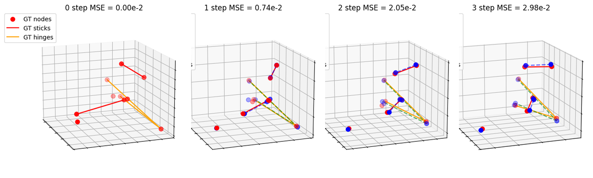
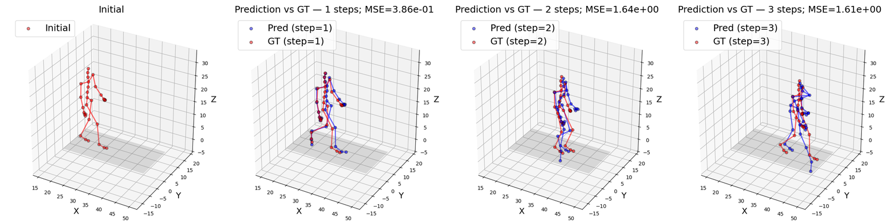

# A Physics-Informed Graph Neural Network Conserving Linear and Angular Momentum for Dynamical Systems

Official PyTorch implementation of the paper, published in *Nature Communications*
([article](https://www.nature.com/articles/s41467-025-67802-5), [preprint](https://arxiv.org/abs/2501.07373)).

The model (`DynamicsSolver`) is a learned integrator. Instead of regressing the next state
directly, it decodes per-edge impulses in a local frame that flips sign when the edge is
traversed the other way. Linear momentum is therefore conserved by construction rather than
by a penalty term, and angular momentum is handled by splitting each impulse into orbital
and spin parts about a learned reference point.

Two systems are included. The n-body case is the cleanest demonstration and is documented
first: it has an exact ground-truth simulator, so error can be measured against the true
trajectory rather than against a held-out recording.

---

## Results

Rollout error is mean squared error against ground truth, autoregressive from a single
initial state. Reproduced with the shipped checkpoints on the commands in [Usage](#usage).
Scattering impulses onto nodes uses `index_add_`, whose CUDA ordering is not deterministic,
so the last quoted digit moves between runs.

**N-body — 3 isolated particles, 2 sticks, 1 hinge**

| Rollout | 1 step | 2 steps | 3 steps | 4 steps |
|---|---|---|---|---|
| MSE | 1.6175e-02 | 8.3660e-02 | 2.3197e-01 | 4.8119e-01 |



Red is ground truth, blue is prediction. Red lines are rigid sticks, orange are hinges. This
is a good case, the 10th percentile of 200 test sequences by 3-step error, not the best one.

Accuracy varies a lot between sequences, so one picture does not represent the case on its
own. Across those 200, 3-step MSE runs:

| | p10 | median | p90 |
|---|---|---|---|
| 3-step MSE (×1e-2) | 2.98 | 12.65 | 55.06 |

The median is roughly four times the figure above and the tail is an order of magnitude
worse, so expect `--mode visual`, which samples at random, to produce something looser than
this most of the time.

The model is told which edges are sticks or hinges through an edge feature, but rigidity is
never enforced on the output — there is no constraint projection or correction step. It is
therefore only approximately preserved, and the error compounds as the rollout runs. Measured
over a test batch as the relative change in rigid-link length from the initial state:

| Rollout | median | p90 | p99 |
|---|---|---|---|
| 1 step  | 1.7% | 7.4% | 16.4% |
| 4 steps | 4.7% | 18.7% | 58.6% |

Typical links hold their length to within a few percent, which is why the overlay looks tight,
but the tail is long — a small number of links distort badly. Anything needing hard rigidity
would have to impose it explicitly on top of the model.

**Human walk — CMU MoCap subject 35**

| Rollout | 1 step | 2 steps |
|---|---|---|
| MSE | 0.3570 | 1.3149 |



The figure shows the best-predicted test sequences; `--mode visual` ranks every sequence by
its 2-step rollout error and plots the lowest.

---

## Installation

```bash
conda env create -f environment.yml
conda activate dyngnet
```

This pins Python 3.12, PyTorch 2.7.0 and the rest of the stack; `requirements.txt` holds the
pip half if you would rather build the environment yourself. A CUDA GPU is expected. Select
one with `CUDA_VISIBLE_DEVICES=<n>`; the default is device 0.

---

## Data

None of the raw trajectories are committed. Each case rebuilds with one command, but the
two differ in how exactly they reproduce, which matters if you intend to compare numbers.

**N-body** — generated by the simulator in `case_03_nbody/simulate_sys/`:

```bash
cd case_03_nbody
python -u generate_data.py --num-train 5000 --seed 43 \
    --n_isolated 3 --n_stick 2 --n_hinge 1 --n_workers 1 --path data_321
```

`para_comp` draws from the global NumPy RNG and takes no per-simulation seed, so `--seed`
only pins the output when `--n_workers 1`. We verified this: at one worker a rerun is
bit-identical, at four workers it is not. The dataset behind the numbers above was generated
with 50 workers and so cannot be reproduced bit-for-bit. Regenerating gives a statistically
equivalent system of the same composition, not the same arrays. Use one worker if you need
determinism — it is much slower.

This costs less than it sounds. We generated a fresh 500-simulation test set from a different
seed on a single worker and scored the shipped checkpoint on it:

| Rollout | shipped `data_321` | independently generated |
|---|---|---|
| 1 step | 1.6175e-02 | 1.5820e-02 |
| 2 steps | 8.3660e-02 | 8.0821e-02 |
| 3 steps | 2.3197e-01 | 2.2813e-01 |
| 4 steps | 4.8119e-01 | 4.7030e-01 |

Within 1–4%, and slightly lower on the new data. The arrays do not reproduce; the numbers do.

**Human walk** — CMU Motion Capture subject 35, using the preprocessed release from
[GMN](https://github.com/hanjq17/GMN) so that both methods train on identical data:

```bash
python case_01_human_walk/get_data.py
```

This downloads `motion.pkl` and checks it against a known SHA256. The `split_n*.pkl` files
are committed, not downloaded: they fix which frames of which trials are drawn, and the
reported errors only reproduce if they are the ones used. Deleting them resamples the
selection and shifts the numbers.

---

## Usage

Every case has an entry script with `train`, `test` and `visual` modes. Hyperparameters live
in the `config.py` of the corresponding case folder.

**N-body.** `--test_config` sets the composition as `"n_isolated,n_stick,n_hinge"`, letting
you evaluate on a system the model was not trained on.

```bash
python main_nbody.py --mode train
python main_nbody.py --mode test   --test_config "3,2,1"
python main_nbody.py --mode visual --test_config "3,2,1"
```

**Human walk.**

```bash
python main_human_walk.py --mode train
python main_human_walk.py --mode test
python main_human_walk.py --mode visual
```

Visualisations land in the case's `results/`.

> `--mode train` empties the case's `saved_models/` before it starts, so running it on a
> fresh clone deletes the checkpoint that ships with the repository. Copy it elsewhere first
> if you want to keep it, or restore it afterwards with `git checkout`.

Two settings are worth knowing before changing them. `delta_frame` is the stride in frames
between one model step and the next, 10 for n-body and 30 for human walk; the
reported errors are per step of that size, so changing it changes what a "step" means.

For n-body, every sample starts at frame 30 of its trajectory, so one trajectory gives one
sample and `max_training_samples` counts both. This follows GMN, whose loader fixes
`frame_0, frame_T = 30, 40`, and matters because the paper varies the training set between
500 and 1500 samples to measure data efficiency. The loader can draw a different start frame
per sample instead, via `random_start_frame`, which turns the same 500 trajectories into
about 28 times as many; it is off by default because results then stop being comparable with
the published ones.

---

## Model

```
   state (x, v, v_prev, ω)
            │
            ├── NodeEncoder ─────────────► node latent
            │
            ▼
      RefFrameCalc  ──►  per-edge orthonormal frame (a, b, c)
            │
            ▼
    InteractionEncoder ──► project relative quantities into (a, b, c)  ─► invariant scalars
            │
            ▼
    InteractionDecoder ──► Δp_ij  (linear impulse),  Δs_ij  (spin impulse)
            │
            ▼
  Node_Internal_Dv_Decoder ──► scatter to nodes, scale by learned m⁻¹, I⁻¹
            │
            ▼
   trapezoidal position step ──► (x, v, ω) at t+1
```

### The edge frame

Each edge builds its own orthonormal basis from relative position and velocity:

```
  a = (x_j - x_i) / ‖x_j - x_i‖          the edge direction

  b  ⟂ a,  built from a sum of terms in the relative and summed velocities and
           angular velocities:  Δv × a,  v_i + v_j,  Δω × a,  ω_i + ω_j, …

  c  ⟂ a, b                              completes the orthonormal triple
```

`c` is `±(a × b)`: the construction is `(b·a)a × b`, so the sign follows `b·a` and the triple
is right-handed on roughly half the edges. Handedness is not fixed, and does not need to be —
what the conservation argument below requires is that all three vectors flip together under
edge reversal, which they do.

Inputs are projected into this frame before the MLPs see them, so the network only ever
receives scalars. Rotating or translating the whole system leaves those scalars unchanged,
which is where SE(3) equivariance comes from — the output is rebuilt by multiplying learned
coefficients back onto `(a, b, c)`, so it rotates with the system.

### Why momentum is conserved

Edges are stored in both directions. Traversing an edge the other way flips `a`:

```
      edge (i → j)                          edge (j → i)

    i ●─────────▶─────────● j            i ●─────────◀─────────● j
              a                                    a

    a = (x_j - x_i)/‖·‖                  a = (x_i - x_j)/‖·‖ = −a

    Δp_ij = c₀a + c₁b + c₂c              Δp_ji = −Δp_ij
```

The coefficients `c₀, c₁, c₂` are functions of frame-projected scalars. Projections are dot
products of the flipped basis with quantities that themselves flip (`x_j − x_i`, `v_j − v_i`),
so the scalars are unchanged and only the basis flips. `Δp_ji = −Δp_ij` therefore holds
exactly, for any weights and at any point in training — Newton's third law, and summing over
the graph gives zero net change in linear momentum.

This is checkable. Running an untrained model over a test batch of the n-body system, across
all four message-passing steps and all 720 edges:

```
max |Δp_ij + Δp_ji|  =  0.0        (exactly zero, not small)
|Σ Δp| over all edges ≈  1e-07     (float32 summation roundoff; mean |Δp| ≈ 0.1)
```

The weights are random, so this is a property of the construction rather than something the
model learns to approximate.

Angular momentum is handled in `InteractionDecoder`. The decoder emits the *total* angular
impulse `Δl_ij` and a learned weighting `w` that places a reference point between the two
nodes, `r₀ = (w_i x_i + w_j x_j)/(w_i + w_j)`. The orbital part carried by the linear impulse
is then subtracted off, leaving the spin:

```
  Δs_ij = Δl_ij − (x_j − r₀) × Δp_ij
```

Mass and inertia are not given to the model. `Node_Internal_Dv_Decoder` decodes `m⁻¹` and
`I⁻¹` from the node latent through a softplus, so both stay positive, and applies them to the
aggregated impulses.

### External influence

Interactions between nodes conserve momentum, so an isolated system cannot gain or lose it.
The external term is the one path that can, and it is written as a scalar times the node's
own velocity:

$$\Delta \vec{v}^{\text{ext}}_i = \psi_{n4}(\mathbf{h}_i)\,\vec{v}_i$$

A scalar multiplying a vector that already rotates with the system keeps the whole model
equivariant, and the form restricts this term to acting along the direction of travel — drag,
not an arbitrary steering force.

It is switched per case by `use_ext_force`, and only built when true:

| Case | `use_ext_force` | Why |
|---|---|---|
| Human walk | `True` | gravity and ground contact act on the walker |
| N-body | `False` | closed system: `compute_F` is pairwise Coulomb only, nothing external |

The n-body setting is worth spelling out, because it costs something. Trained with the head
on, that case scored 1.4796e-02 at one step against 1.6175e-02 with it off — better by 9%.
But the head has nothing to represent there: the simulator applies no external force, and
ground-truth momentum is conserved to 0.03%. The gain was extra capacity fitting the one-step
target, and it does not survive the rollout — by four steps the model without the head is
ahead (4.8119e-01 against 4.8982e-01), its rigid links drift less, and its momentum violation
is 7.4× smaller. We ship the model that matches the physics.

Checkpoints are tied to the setting: one saved with the head on will not load with it off,
because the external decoder's tensors have nowhere to go.

---

## Repository layout

```text
DYNGNET/
├── case_01_human_walk/
│   ├── data/                   # split_n*.pkl ship; motion.pkl is downloaded
│   ├── get_data.py             # fetches motion.pkl, verifies SHA256
│   ├── config.py               # hyperparameters and seed
│   ├── dataset.py              # graph construction
│   └── visualization.py
│
├── case_03_nbody/
│   ├── simulate_sys/           # ground-truth simulator
│   │   ├── physical_objects.py
│   │   └── system.py
│   ├── generate_data.py
│   ├── config.py
│   ├── dataset.py
│   └── visualization.py
│
├── model/model.py              # DynamicsSolver and its blocks
├── utils/
│   ├── trainer.py              # training loop and checkpointing
│   └── utils.py                # math helpers, evaluation, seeding
├── main_nbody.py
├── main_human_walk.py
├── environment.yml
└── requirements.txt
```

---

## Note on checkpoints

The external term previously decoded a Cartesian vector from rotation-invariant inputs. That
vector did not rotate with the system, so this one term broke the equivariance the rest of
the model is built on. It now decodes the scalar coefficient described above.

Measured on the current code, n-body case, untrained weights, random `R ∈ SO(3)`:

```
Δx:  max |R f(x) − f(Rx)| = 3.6e-06   (output scale 6.7e-01,  relative 5e-06)
Δv:  max |R f(x) − f(Rx)| = 2.1e-05   (output scale 5.6e+00,  relative 4e-06)
```

That is float32 accumulation over four message-passing steps, not a residual asymmetry.

Checkpoints produced before this change will not load, because the external decoder's output
width went from 3 to 1. Every model in this release was retrained afterwards.

---

## License

[Non-Commercial License Agreement](LICENSE.txt). Use is granted for academic and other
non-commercial research; downloading or using the Program constitutes acceptance. The licence
does not permit re-using parts of the Program in other programs, and requires that the
copyright headers in the source files are left intact. Redistribution is permitted only for
academic, non-commercial purposes and only with a copy of the licence included.

For commercial licensing, contact [EPFL's Technology Transfer Office](https://tto.epfl.ch/).

Cite as set out in [CITATION.cff](CITATION.cff), which also carries the acknowledgement text
the licence asks for.

The n-body simulator and its data generator come from GMN and stay under their original MIT
licence, which this agreement does not restrict; see
[THIRD_PARTY_NOTICES.md](THIRD_PARTY_NOTICES.md).

---

## Citation

```bibtex
@article{dyngnet2025,
  title   = {A physics-informed graph neural network conserving linear and angular
             momentum for dynamical systems},
  journal = {Nature Communications},
  year    = {2025},
  url     = {https://www.nature.com/articles/s41467-025-67802-5}
}
```
